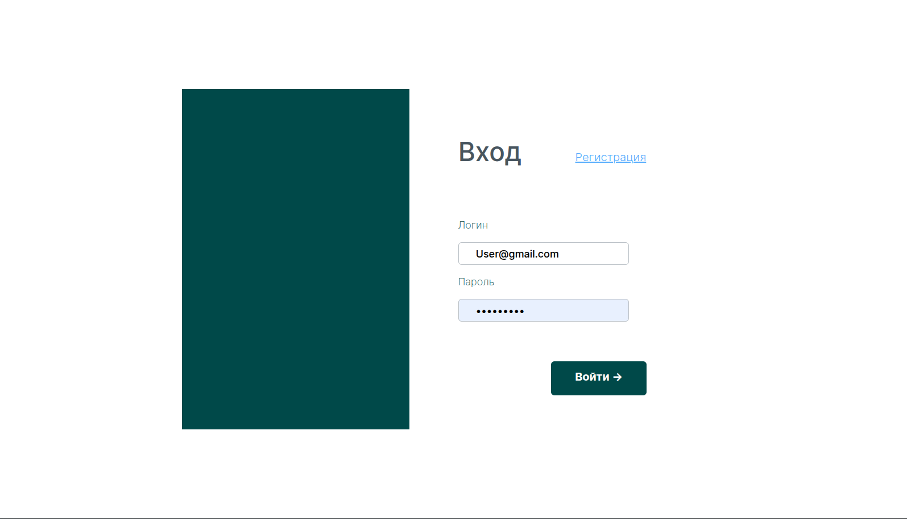
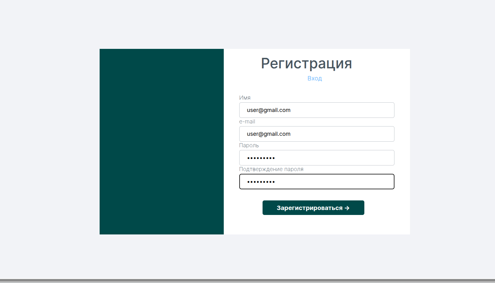
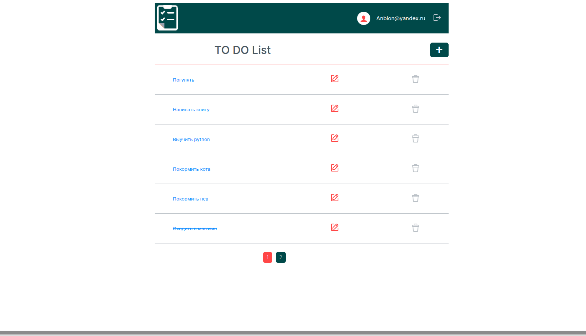
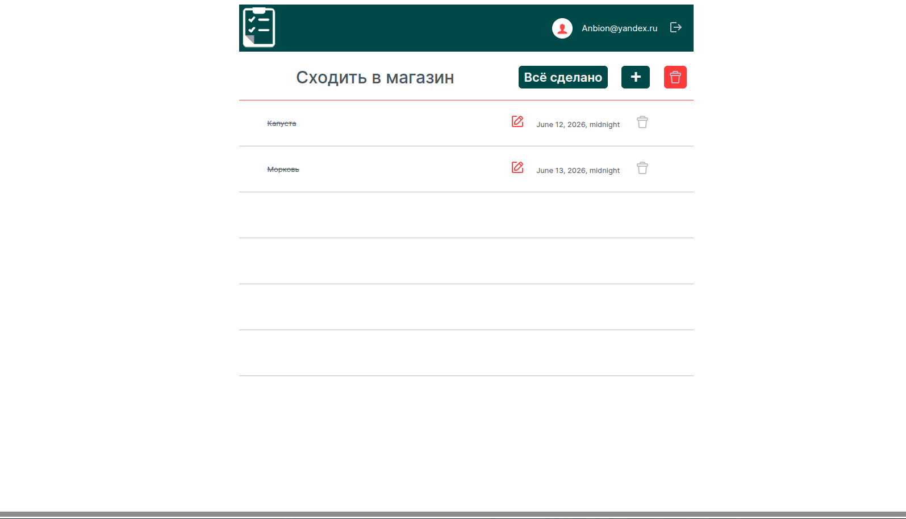

# Django ToDo Lists

Веб-приложение для управления списками задач, разработанное на Django.

Проект позволяет пользователям создавать собственные списки дел, добавлять задачи, отмечать их выполнение и отслеживать состояние списков.

---

## Features

### User Management

* Регистрация пользователей
* Авторизация
* Выход из системы
* Изоляция пользовательских данных

### Task Lists

* Создание списков задач
* Редактирование списков
* Удаление списков
* Просмотр всех списков пользователя
* Пагинация результатов

### Tasks

* Добавление задач в список
* Редактирование задач
* Удаление задач
* Отметка выполнения задачи
* Установка даты завершения

### Business Logic

* Автоматическое завершение списка при выполнении всех задач
* Автоматическое снятие статуса завершения списка при появлении незавершённой задачи
* Проверка уникальности списков пользователя
* Проверка уникальности задач внутри списка

### Testing

Проект содержит:

* Unit Tests
* Functional Tests
* Django Forms Tests
* View Tests
* Model Tests

---

## Tech Stack

### Backend

* Python
* Django
* PostgreSQL

### Infrastructure

* Docker Compose

### Testing

* Pytest
* Django Test Framework

---

## Project Structure

```text
.
├── Khlopkov/
│   ├── settings.py
│   ├── urls.py
│   └── wsgi.py
│
├── main/
│   ├── models.py
│   ├── views.py
│   ├── forms.py
│   └── tests/
│
├── list_item/
│   ├── models.py
│   ├── views.py
│   ├── forms.py
│   └── tests/
│
├── registration/
│   ├── views.py
│   ├── forms.py
│   └── tests/
│
├── infrastructure/
│   └── postgres/
│
├── docker-compose.yml
├── requirements.txt
└── manage.py
```

---

## Data Model

### ListModel

Список задач пользователя.

| Field    | Description       |
| -------- | ----------------- |
| name     | Название списка   |
| user     | Владелец списка   |
| is_done  | Статус завершения |
| created  | Дата создания     |
| modified | Дата изменения    |

---

### ListItemModel

Отдельная задача внутри списка.

| Field           | Description       |
| --------------- | ----------------- |
| name            | Название задачи   |
| listmodel_id    | Ссылка на список  |
| is_done         | Статус выполнения |
| expiration_date | Срок выполнения   |
| created         | Дата создания     |
| modified        | Дата изменения    |

---

## Screenshots

### Login Page



---

### Registration Page



---

### Main Page



---

### Task List



---

## Installation

### Clone Repository

```bash
git clone https://github.com/Anbionchik/django_educational_project.git

cd django_educational_project
```

---

### Run PostgreSQL

```bash
docker compose up -d
```

---

### Install Dependencies

```bash
pip install -r requirements.txt
```

---

### Apply Migrations

```bash
python manage.py migrate
```

---

### Run Server

```bash
python manage.py runserver
```

Application will be available at:

```text
http://127.0.0.1:8000
```

---

## Running Tests

Run all tests:

```bash
pytest
```

Run Django tests:

```bash
python manage.py test
```

---

## What I Practiced

В рамках проекта были отработаны следующие навыки:

* разработка MVC/MVT-приложений на Django;
* работа с ORM Django;
* построение пользовательской аутентификации;
* работа с PostgreSQL;
* Docker-контейнеризация;
* написание unit и functional тестов;
* работа с формами Django;
* пагинация данных;
* реализация бизнес-логики на уровне моделей.


---

## Author

Andrey Khlopkov

Data Analyst / Data Engineer / Python Developer

GitHub: Anbionchik
